# WorkLog Pro — UI/UX Audit (Phase 1)

**Scope:** audit and recommend only — no code, CSS, or markup was changed in this pass.
**Stack constraint honored:** vanilla JS + HTML5 + Tailwind CSS (CDN, no build step) + FontAwesome. No framework/component-library migration is proposed anywhere below.

---

## Tools used, and what was skipped (and why)

| Tool | Applicable to this stack? | Used how |
|---|---|---|
| **Impeccable** (`.impeccable/`, already integrated in this repo) | Yes — it's a raw HTML/Tailwind/CSS analyzer, framework-agnostic. | Ran `impeccable detect --json` directly against both shells. Its static analyzer degraded to regex-matching (the HTML-parser modules — `htmlparser2`/`css-select`/`css-tree`/`domutils` — aren't installed in this environment), so it could only catch literal class-name patterns, not computed contrast or cascade. All 16 findings it returned are `gray-on-color` (disabled-button states, or a resting-state element on a transparent background — already reviewed and confirmed false positives earlier this session, recorded in `.impeccable/config.json`) and `ai-color-palette` (flagging the indigo/purple accent usage generically). Treated as one input, re-verified by hand below rather than taken at face value — see "Color usage" for the actual judgment call. |
| **`ui-ux-pro-max`** (main skill + `--domain typography`/`ux`) | **Partially.** Its reference *data* (palette tokens, font pairings, named UX-guideline citations) is stack-agnostic and was used below. Its *component-generation* half (`ui-ux-pro-max:ui-styling`) is explicitly built for React + shadcn/ui — that half was **not used and nothing from it was forced onto this codebase.** | Queried `--design-system` for a palette/typography starting point (see "Proposed design system" below) and `--domain ux` for two specific patterns already observed as broken (fixed-nav overlap, table overflow) to confirm they're named, common anti-patterns and not just personal taste. |
| `design` (Claude Design canvas), `dataviz`, `21st.dev`-style component libraries | **No — skipped, not applicable.** `design` is for drafting new mockups, not auditing an existing app. `dataviz` targets charts/graphs; this app only has stat tiles and tables, not charts. Anything in the 21st.dev/shadcn family generates React component code, which cannot be dropped into this vanilla-JS app without a rewrite — using it would have meant either forcing a foreign pattern in by hand or quietly nudging the stack toward React, neither of which was asked for. | Not run. |

Everything below is my own judgment against the named principles, using the automated findings as one data point among several — not a substitute for looking at the actual screens.

---

## Method

Both shells were launched with realistic, deliberately-seeded data (2 projects, 8 shift entries including one 2-session "assembled" day and one overnight-spanning entry, 3 expenses, one paid + one outstanding exported invoice) in disposable, isolated profiles — no real user data was touched. `platform-electron` was driven via Electron at 1280×900; `platform-web` was driven via headless Chrome at 390×844 (iPhone-width). Screenshots referenced below live in `docs/ui-ux-audit/screenshots/`.

---

## Top 5 highest-impact issues

These are the ones actually responsible for the "crowded" feeling and for real usability breakage — not polish nits. Full detail and a concrete direction for each is under "Concrete recommendations."

1. **[HIGH] On mobile, the fixed bottom tab bar overlaps the last row(s) of scrollable content on every tab.** The Timer tab's shift-history table is visibly cut off behind an opaque tab bar with no compensating padding. *(Interaction flow / whitespace)*
2. **[HIGH] Every data table (Logs, Expenses, Invoices) loses its rightmost columns — including the primary action buttons — off-screen on mobile, with no visual cue that more content exists.** On the seeded Invoices tab, a mobile user cannot see an invoice's Total, Paid/Outstanding status, or its action buttons (reopen / delete / **mark as paid**) at all without discovering an unhinted horizontal swipe. *(Information density / progressive disclosure)*
3. **[HIGH] Desktop's "Shift Settings" card conflates four unrelated concerns — pay rate, shift notes, invoice signature, and cloud sync/authentication — into one flat, undifferentiated list.** Mobile's equivalent Settings sheet already solves this with proper section headers (`PROJECT` / `SHIFT SETTINGS`); desktop never got the same treatment, so a major feature (signing in) has no more visual weight than a placeholder notes field. *(Consistency / information architecture)*
4. **[HIGH] The four dashboard stat tiles (Worked Hours, Work Earnings, Expenses/Bills, Total Payout Due) render at identical size and weight.** "Total Payout Due" — arguably the single number a freelancer opens the app to check — gets no more visual priority than "Expenses/Bills." *(Visual hierarchy)*
5. **[MEDIUM–HIGH] The Create Invoice modal is one long undifferentiated scroll** — business info, a date-range picker, a "Find Shifts & Expenses" trigger, a shift checklist, an expense checklist, discount, and signature toggle are all stacked in a single vertical flow with no section separation or sticky action. This is very likely the single most "crowded-feeling" screen in the app. *(Information density / progressive disclosure)*

---

## Per-screen breakdown

Severity: **High** = actively breaks usability or drives the crowded feeling. **Medium** = a real, fixable inconsistency. **Low** = polish-level.

### Desktop — Main dashboard
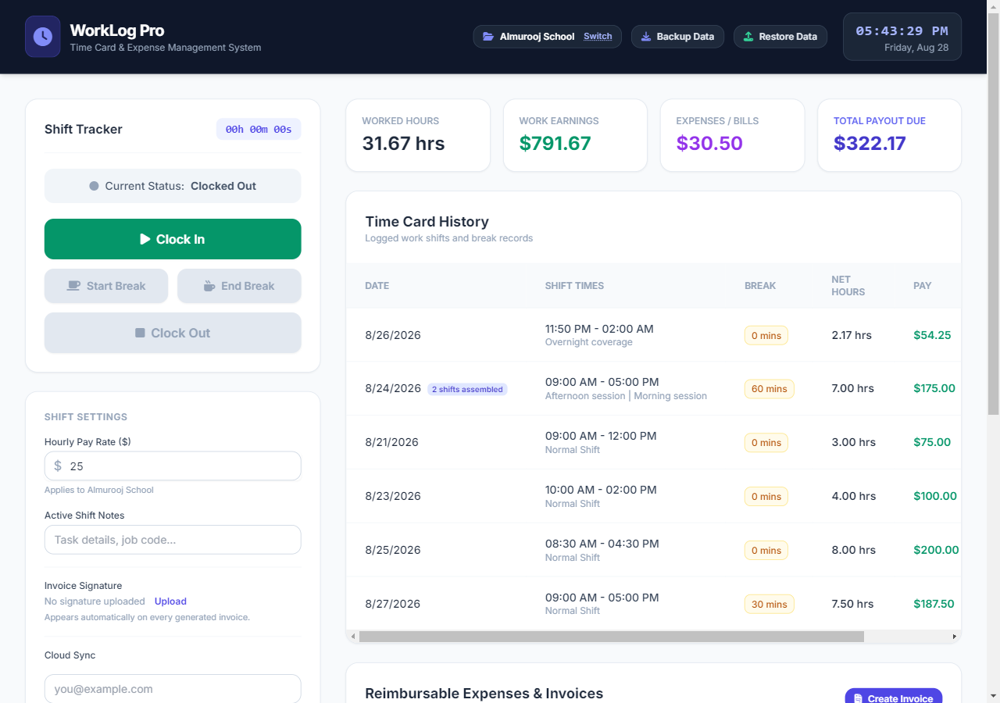

| Issue | Principle | Severity |
|---|---|---|
| 4 stat tiles at equal visual weight (see Top 5 #4) | Visual hierarchy | High |
| Logs table needs horizontal scroll to reach Edit/Delete at a standard 1280px viewport — 5 columns (Date/Times/Break/Net Hours/Pay) plus an actions column don't fit | Information density | Medium |
| "Shift Settings" card bundles 4 unrelated concerns with no section labels (see Top 5 #3) | Consistency / hierarchy | High |
| "Add Past Entry" / "Add Expense" buttons float outside any card, disconnected from the section they act on | Whitespace / grouping | Low |
| Break-time badge, session-count badge, and category badge all share the same visual treatment (rounded pill, `text-xs`) — a good consistency win worth *keeping*, not a finding | Consistency | — (positive) |

### Desktop — Reimbursable Expenses & Invoice History
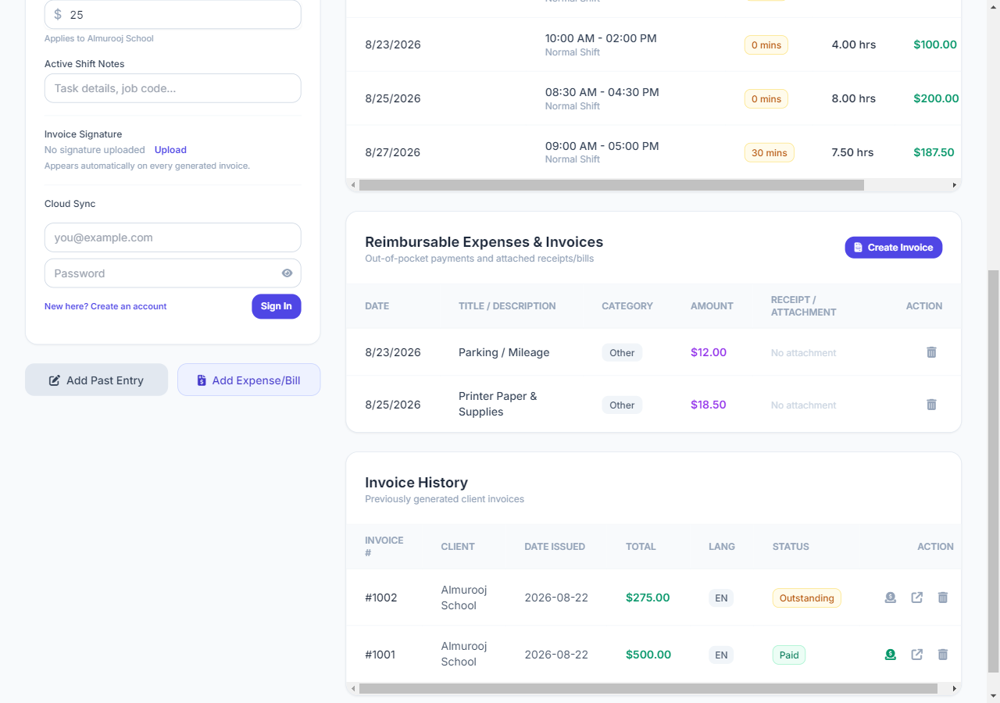

| Issue | Principle | Severity |
|---|---|---|
| Expenses table also requires horizontal scroll to reach the delete action | Information density | Medium |
| Invoice History's new Paid/Outstanding badge + mark-paid icon read cleanly and reuse the existing badge convention — genuinely good, no finding here | Consistency | — (positive) |
| Both tables' horizontal scrollbar is the only affordance that more columns exist — thin, easy to miss, no "peek" of the next column | Information density | Medium |

### Desktop — Project Picker
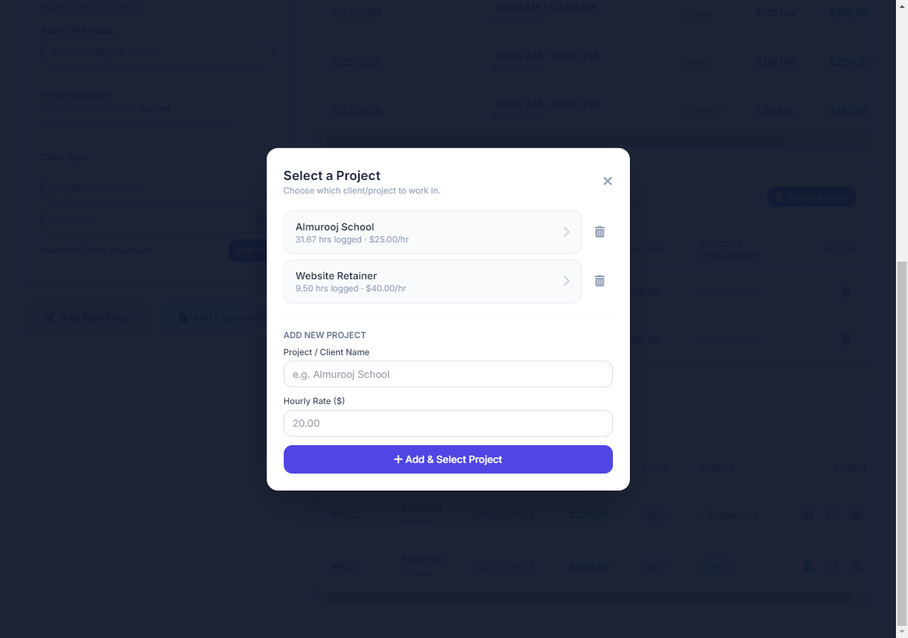

Clean. Clear separation between "existing projects" and "add new," decent spacing, no findings above Low.

### Desktop — Manual Entry (Add / Edit)
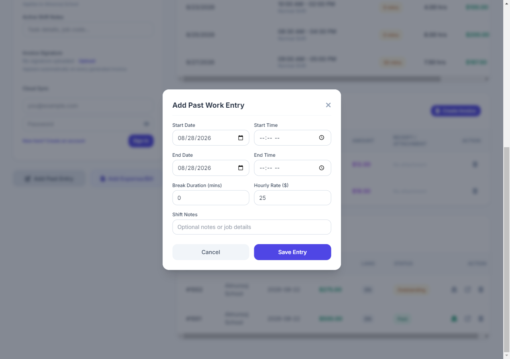

| Issue | Principle | Severity |
|---|---|---|
| Editing an "assembled" (multi-session-merged) row shows a single Start/End/Break that *looks* like one continuous shift with a lunch break — the only hint that it's actually 2+ real sessions being collapsed is the small text in the Notes field ("Afternoon session \| Morning session"). Saving here silently discards the individual session boundary. | Progressive disclosure / clarity | Medium |
| Otherwise: clean, well-spaced, good example of the form pattern | — | — (positive) |

### Desktop — Expense Modal
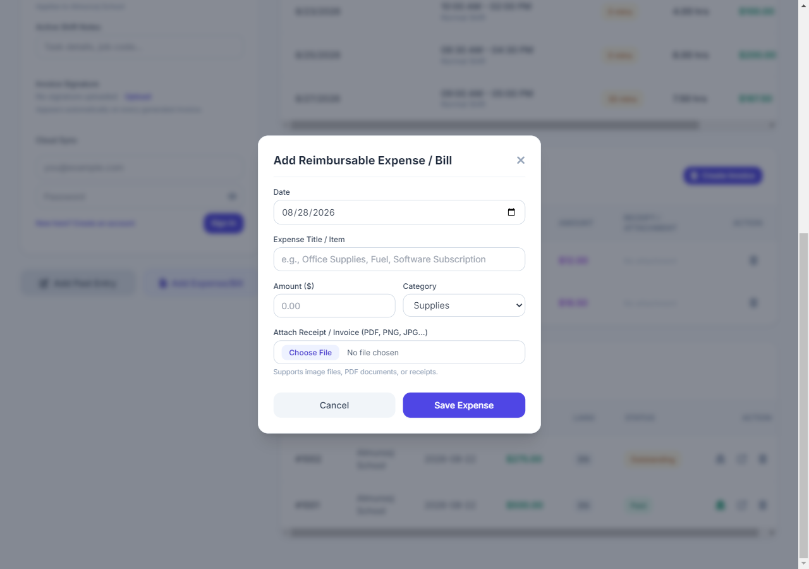

Consistent with the Manual Entry modal's field style. No findings above Low.

### Desktop — Create Invoice
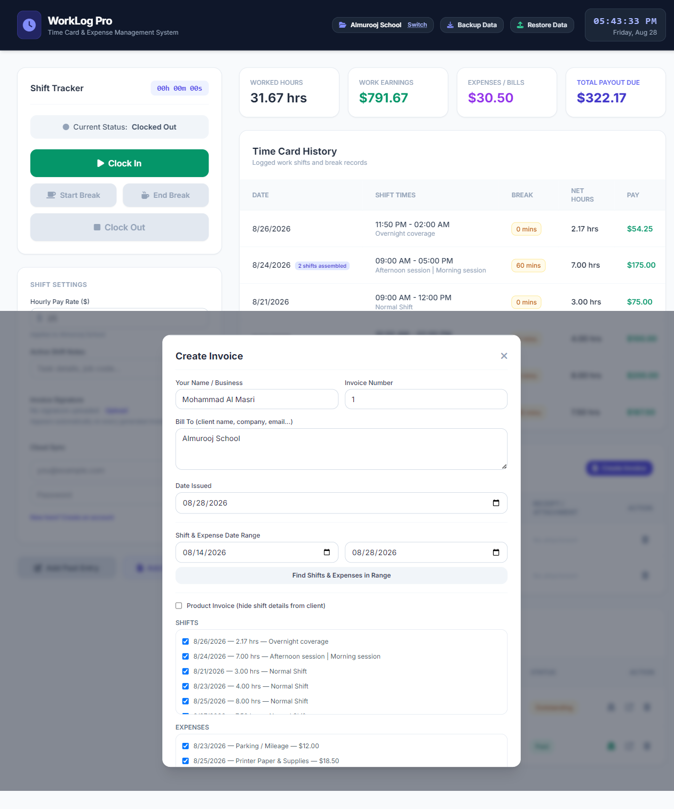

See Top 5 #5. Additionally: the Shifts and Expenses checklists are plain bordered boxes visually identical in weight to the metadata fields above them — nothing distinguishes "data you're selecting" from "data you're typing."

### Desktop — Invoice Preview / Editor
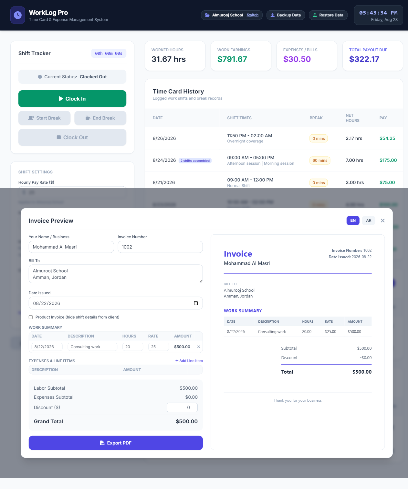

The best screen in the app. Clean split editor/preview, generous whitespace in the preview pane, clear hierarchy (Invoice number/date → Bill To → line items → totals). Worth treating as the reference for what "done well" looks like elsewhere.

### Mobile — First-run screen
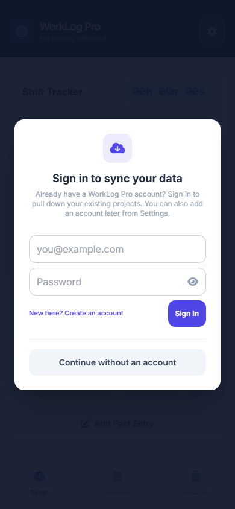

Clean, calm, appropriately minimal. No findings above Low.

### Mobile — Timer tab
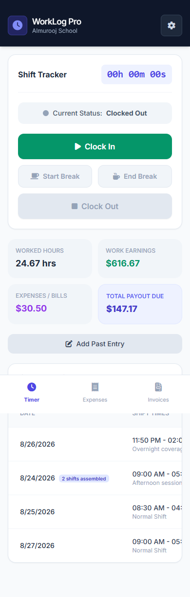

| Issue | Principle | Severity |
|---|---|---|
| Fixed bottom tab bar overlaps the shift-history table (Top 5 #1) | Interaction flow | High |
| Otherwise the Shift Tracker card and 2×2 stat grid read well at this width | Visual hierarchy | — (positive) |

### Mobile — Expenses tab
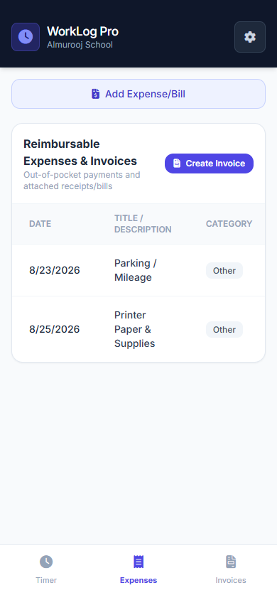

Amount, Receipt/Attachment, and the delete action are entirely off-screen with no scroll hint (Top 5 #2). **High.**

### Mobile — Invoices tab
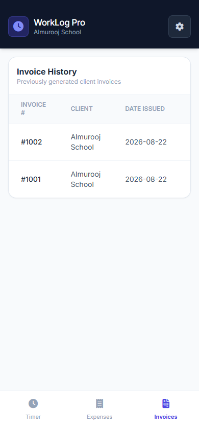

Same as above — Total, Status (the mark-as-paid badge), and all three action buttons (mark paid / reopen / delete) are entirely off-screen (Top 5 #2). This is the most severe instance of the pattern: it hides a feature that shipped this session, not just secondary metadata. **High.**

### Mobile — Settings sheet
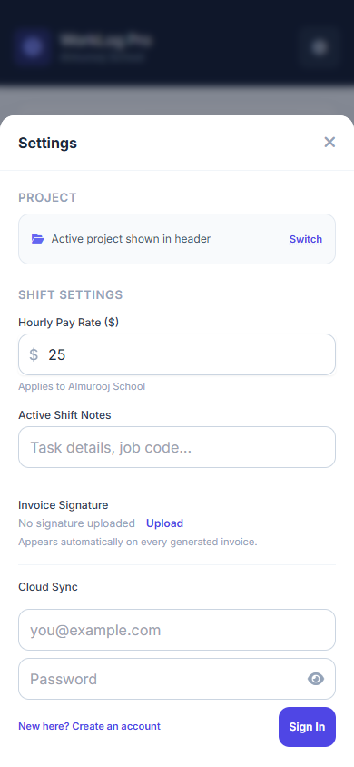

Genuinely better organized than its desktop counterpart — `PROJECT` and `SHIFT SETTINGS` section headers give real grouping. **This is the pattern desktop should adopt, not the other way around.**

### Mobile — Manual Entry modal
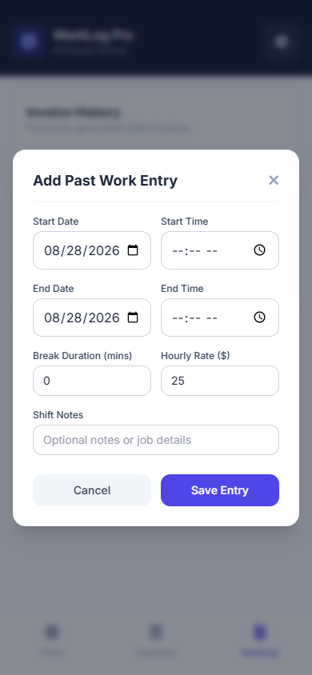

Confirmed: inputs use `text-base` (16px, avoids iOS zoom-on-focus) and sit comfortably above 44px tap height, per section 4J's own convention. No findings.

---

## Accessibility / contrast

No *new* genuine WCAG contrast risks were found beyond what Impeccable already flagged and this project already reviewed and dismissed as false positives (paired `disabled:bg-*`/`disabled:text-slate-400` states that never render simultaneously with a colored background, and a couple of resting-state elements on transparent/white backgrounds). Badge colors throughout (`bg-emerald-50`/`text-emerald-700`, `bg-amber-50`/`text-amber-700`, `bg-rose-50`/`text-rose-600`) are Tailwind's well-known safe light-bg/dark-text pairing and comfortably clear 4.5:1. Stating this plainly rather than inventing findings to pad the count.

## Touch targets (platform-web)

Spot-checked against section 4J's 44px/16px convention: the Manual Entry modal, Expense modal, and Settings sheet inputs all comply (confirmed visually and via the `min-h-[44px]`/`text-base` classes already in the markup). The one place this convention is effectively **moot** rather than violated: the cut-off table action buttons in Top 5 #2 — a control that's off-screen has no touch-target size to evaluate in the first place. Fixing #2 will re-expose those buttons; re-check their tap size specifically once that happens.

## Color usage — a more precise read than the automated flag

Impeccable's `ai-color-palette` rule flags indigo/purple as a generic tell. Counting actual usage across both shells' markup *and* the JS render templates that generate table/badge HTML (`core/ui.js`, `core/invoicing.js`) tells a more specific story:

| Color | Uses | Apparent role |
|---|---|---|
| slate | 593 | neutral (text, borders, backgrounds) |
| indigo | 131 | primary brand / links / primary buttons |
| rose | 26 | danger / delete |
| amber | 20 | caution / pending / break-in-progress |
| emerald | 19 | positive / earnings / paid |
| blue | 5 | one secondary action ("End Break") |
| purple | 3 | expenses accent only |

This is **not** a noisy, inconsistent palette — it's a coherent semantic system (indigo=primary, emerald=positive, amber=caution, rose=danger) applied consistently across both shells. The real critique is narrower than the automated tool suggests: every one of these hues is Tailwind's **unmodified default shade** — nothing here was chosen for this brand specifically. That's a legitimate "give the app an identity" finding, but it is **not** the high-severity "confusing/broken" issue the raw hook output implies. Downgraded accordingly to a design-system recommendation below, not a Top-5 item.

## Typography scale

Quantified rather than eyeballed: `platform-electron/shell.html` uses Tailwind's standard scale (`text-xs` ×79, `text-sm` ×56, `text-lg` ×18, `text-xl` ×6, `text-base` ×5, `text-2xl` ×5, `text-3xl` ×4) **plus 12 arbitrary bracket sizes** (`text-[11px]` ×11, `text-[10px]` ×1) that fall *between* the standard steps for no apparent reason. `platform-web/index.html` is worse: the standard scale **plus 20** arbitrary sizes across **four** different one-off values (`text-[11px]` ×15, `text-[13px]` ×3, `text-[17px]` ×1, `text-[10px]` ×1). That's 9–10 distinct font sizes in effective use per file — this is exactly the "ad-hoc sizing crept in over many features" pattern the brief asked about, and it's real, not a hunch.

## Interaction flow

Confirmed via code, not just screenshots: every modal in the app (Manual Entry, Expense, Create Invoice, Invoice Preview, Project Picker, Edit Break) opens and closes via an instant `hidden`↔`flex` class toggle — there is no transition, fade, or scale-in anywhere in either shell. Every modal in the entire app snaps open and shut with zero visual continuity. This is systemic (one shared root cause, not 6 separate bugs) and unusually cheap to fix once, since it's the same class-toggle pattern everywhere.

---

## Concrete recommendations

### Proposed lightweight design system

**Spacing** — formalize what's already mostly followed rather than inventing a new scale: card/section padding `p-6` (desktop) / `p-4` (mobile), intra-card gaps `gap-3`/`space-y-3`, inter-section gaps `gap-6`/`space-y-6`. Named and documented so future additions have something to match instead of guessing.

**Typography** — collapse to Tailwind's standard 7-step scale everywhere (`text-xs` through `text-3xl`); eliminate all `text-[Npx]` arbitrary values — each one maps to the nearest standard step with no visible loss (11px→`text-xs`\* with `leading-tight` if the extra tightness mattered, 13px→`text-sm`, 17px→`text-lg`). Separately, given `ui-ux-pro-max`'s dashboard-tuned pairing options, either:
- Keep the current family but formalize the weight scale (this app currently reads as "Inter" per the earlier design-hook flag — a fine, safe, widely-legible choice, just an extremely common default), **or**
- Move to **Public Sans** or **IBM Plex Sans** — both free, both have strong tabular/lining numerals (genuinely useful for an invoicing app's tables and dollar figures), both read as more "chosen" than "default." A two-font pairing (e.g. Poppins headings / Open Sans body, from `ui-ux-pro-max`'s "Modern Professional" match) is possible but probably unnecessary complexity for an app whose content is almost entirely UI chrome, not long-form text — a single well-chosen family is the lighter-weight fix and fits "lightweight redesign" better.

**Color** — keep the existing semantic mapping (it already works: indigo=primary, emerald=positive, amber=caution, rose=danger) but replace the *specific* stock shades with deliberately chosen ones so the app stops looking like unmodified Tailwind defaults. `ui-ux-pro-max`'s "Minimalism & Swiss Style" match (the best-fit result for "professional tools/dashboards") suggests a navy primary (`#1E3A5F`) with a blue secondary (`#2563EB`) and green accent (`#059669`) on a near-white background — a concrete, ready-to-use starting point, not a prescription; the point is picking *something specific* rather than staying on the framework default.

### Direction for each high-severity issue

1. **Fixed tab bar overlap** — add bottom padding/margin to the scrollable tab content equal to the tab bar's real rendered height (plus safe-area inset), the same way the header already reserves space at the top. One shared fix, applies to all three tabs at once.
2. **Tables losing columns off-screen on mobile** — for the Invoices and Expenses tables specifically, switch to a stacked card layout below a width breakpoint instead of a scrolling table (each row becomes a small card: title/description + amount + status badge + actions, stacked vertically) — this is the standard mobile pattern for exactly this failure mode, and it removes the "did I know I could scroll" problem entirely rather than trying to make the scroll affordance more visible.
3. **Desktop Shift Settings card** — split into clearly labeled sections matching what mobile's Settings sheet already does (`PROJECT`, `PAY & NOTES`, `INVOICE SIGNATURE`, `CLOUD SYNC`) with visible section headers, not just thin dividers. Consider whether Cloud Sync specifically deserves its own card entirely, given it's a materially different kind of setting (account/auth) from the other three.
4. **Stat tile hierarchy** — give "Total Payout Due" a visually distinct treatment from the other three tiles: larger value text, a filled/tinted card background instead of the same white card, or moving it to a more prominent position (first, not last). The other three stay as secondary/supporting figures.
5. **Create Invoice modal** — break into visually distinct sections with real separation (background tint or a subtle divider + heading per section: "Invoice Details," "Date Range," "Select Work & Expenses," "Options"), and consider making the shift/expense checklists collapsible or paginated rather than one continuously-scrolling modal.

Two more cheap, high-leverage fixes worth doing alongside the above even though neither made the Top 5 alone:
- **Modal transitions** — a single shared 150–200ms opacity/scale transition class applied to every modal's open/close toggle would measurably improve perceived polish app-wide for very little effort, since it's the same fix in one place conceptually (even though the toggle functions are separate per modal today).
- **Typography cleanup** — replacing the 12–20 arbitrary `text-[Npx]` values with the nearest standard Tailwind step is a mechanical, low-risk cleanup that directly tightens the type scale finding above.

---

*This document is Phase 1 (audit) only. Phase 2 (agreeing on the design system specifics) and Phase 3 (screen-by-screen implementation) are separate, later passes — nothing above has been applied to the codebase.*
